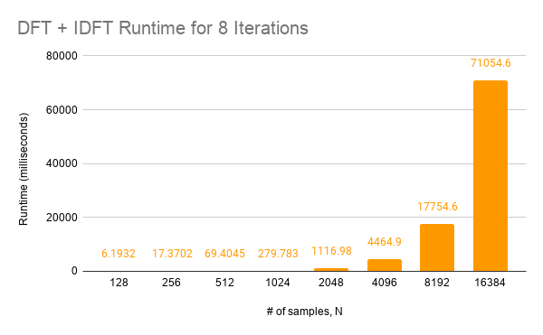
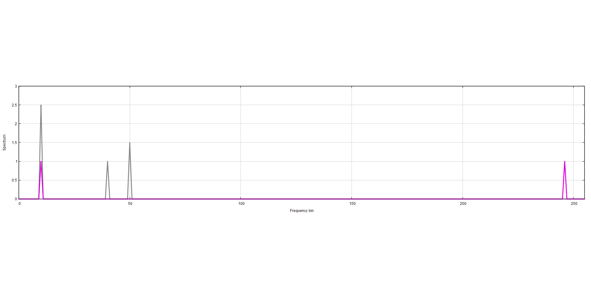

# COE3DY4 Lab 2 - DSP Primitives in C++
## Jingming Liu, liuj171 / Riley Mione, mioner

## Execution Time of DFT and IDFT




In order to make a more efficient and empirical measurement of these runtimes, I wrote a function which takes the existing method for runtime measurement of a DFT and IDFT pair 8 times per each # of samples, and then averages out the runtimes to get a more accurate measure of how long the DFT and IDFT pair takes for each N samples.
As for big O analysis, looking at the code for the DFT and IDFT algorithms from a high level, we can see that they both rely on a nested for loop. We know from previous experience that this is a T(n) = O(n2) time complexity. Therefore when summing up the two runtimes to do time complexity analysis, we know that this ends up being T(n) = O(n<sup>2</sup>) overall. 


## Large Input Sequence Frequency Spectrum Estimate

We implemented a function that breaks up a 1024-sample input into 4 smaller 256-sample inputs and runs the other DFT function on each, then averages all of them using the std::vector accumulate method, which we called large_DFT. When running the large_DFT function that we implemented, on a 1024-sample long input, is around 40ms each time, which was tested empirically by taking several measurements, similar to the previous method. Running the normal DFT algorithm (without breaking it up into segments) on a sample of the same length took an average of 77.8ms. 
This is considerably longer than the frequency spectrum estimate, almost 2 times slower than the large_DFT algorithm, on average, however with more accurate results. The reason why this takes so long is due to the big O time complexity of the DFT algorithm, which due to the double for loop, is T(n) = O(n<sup>2</sup>). Therefore when we run the DFT function on a 1024-sample vector, it takes much longer than on four 256-sample vectors (1024<sup>2</sup> >> 256<sup>2</sup>)



As stated in the lab document, this leads to a very rudimentary, “coarse”  estimate of the frequency spectrum, as shown in figure 2. 


## Block Processing
### Convolution and Low Pass Impulse Functionality
We used our Python code from Lab 1 as a guide to rewrite the block processing algorithm in C++, using our convolveFIR and impulseResponseLPF functions. The impulseResponseLPF function takes inputs of sampling frequency, cut off frequency and number of taps. It returns low pass coefficient as h. impulseResponseLPF is implemented by the same algorithm as Lab1 but the numpy arrays from python are replaced by vectors in C++.  ConvolveFIR takes input signal and the coefficients generated by impulseResponseLPF function. ConvolveFIR  returns the filtered data after the convolution. This process is generated with the same algorithm as Lab1. The 2D numpy arrays from python are also replaced by 2D vectors. From the lab1, np.sum() was used to sum up the inner array of the 2D numpy array. In Lab2 because the accumulate method for vectors in C++ was causing issues, we used a for loop to perform the same duty.  To clarify, the outer vector has a size of the signal and the inner vector has a size of the number of taps. 

### Block Filtering
The block_filtering function is implemented very similar to its contemporary in Lab 1, despite some minor differences such as using a for loop where the Python code used a while loop. It takes input of all the variables impulseResponseLPF and ConvolveFIR need to properly call these two functions. It also needs the split audio_data as input, which is audio_left and audio_right. Five vectors are created for processing the data. Low_p_coe stores the coefficient returned from impulseResponseLPF.  Filtering_Left and filtering_right stores the audio_left and audio_right in blocks respectively. Their sizes are the same as the integer input block_size. Filtered_Left and filtered_right stores the output from the convolveFIR. They represent the filtered data in blocks. The whole process is controlled by a nested for loop with two parallel inner for loops. The outer for loop controls variable position that increment by block_size until the end of the data. The first inner for loop helps store the data into blocks. Then the second inner for loop pushes back the filtered data to the output vector single_pass_left and single_pass_right.The block-filtered audio sounds like a slightly muffled, lower-frequency version of the original, unfiltered test audio. It also has some additional graininess noise due to the accuracy of our filtering algorithm. This is indicative of it being low-pass filtered. 
```c++
impulseResponseLPF(Fs, Fc, num_taps, low_p_coe);

for(int position = 0; position < audio_left.size() ; position+=block_size) {
    for (int i = 0; i < block_size; i++) {
        filtering_left[i] = audio_left[position + i];
        filtering_right[i] = audio_right[position + i];
    }
    convolveFIR(filtered_left, filtering_left, low_p_coe);
    convolveFIR(filtered_right, filtering_right, low_p_coe);
    for (int j = 0; j < block_size; j++) {
        single_pass_left[j + position] = filtered_left[j];
        single_pass_right[j + position] = filtered_right[j];
    }
}
```